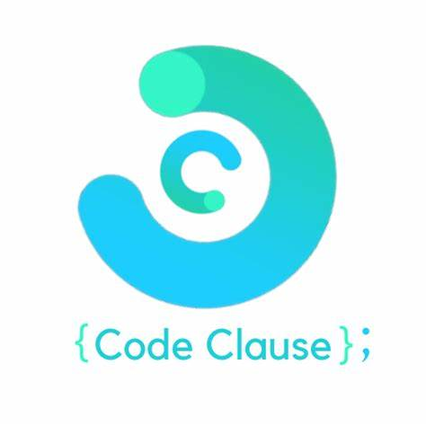

# CodeClause_Music_Player_Task2
Muisc Player in Python Using tkinter for GUI, this is allowcated project by [Codeclause](https://codeclause.com/) 

Author: Rohan Kadam

Github: https://github.com/KRohancoder

# Discription 📀
Python provides vast number of libraries for GUI application development. Tkinter is the widely used library for GUI application development. Using Tkinter library of python which carries large numbers of widgets, we can easily create Graphical User Interface for our application. Pygame is a Python library that provides functionality for playing sounds and music.

# Project Difficulty level 🥇
Beginner

# Programming Language 🐍
Python

# Domain 🏥
Application

# Tools 🛠
This project requires that you have Python installed. Download it here.

It also requires the following Python packages, which can be installed via pip:

-tkinter
-Pygame

Then run it by double clicking on player.py!

# Features !

- Various themes are available.
- play, pause , stop Muisc option available.
- you can select entire music folder to play music.
- you can change music and mute audio also in this application.
- In this player only run MP3 format file

# Editor's Interface Screenshot

=======================================================================

## 📌 Opensource Programs

### [This project is a part of following Open Source Program](https://codeclause.com/)

=======================================================================

# Contributing
Pull requests are welcome. If someone wants to contribute to this project can fork and add the Functionalities Or enhance the GUI.

## Happy Contribution ✨
